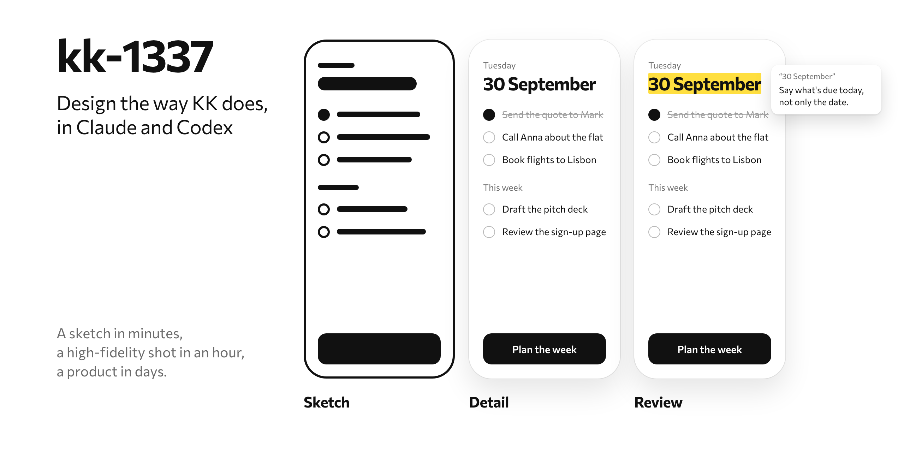

<picture>
  <source media="(prefers-color-scheme: dark)" srcset=".github/hero-dark.png">
  
</picture>

Skills that make Claude and Codex work the way [KK](https://kk.consulting) (Konstantin Konstantinopolskii) does on anything a person will see, read, decide or act on: a screen, a flow, a page, a message, a CV, a deck. They are distilled from about 340 of his comments on agents' design work.

Every decision answers one question: what must this person, at this moment, perceive and do, and what is the least that delivers it, with the most force, in a form that is only this product's?

## What it does

- The agent asks first: one short message with how it reads your task, marked as assumptions, and up to five questions. Correct it, and the work starts.
- A simple task goes straight to the result: a page, a document, a small change, or content for a platform, whose sizes, crops and rules become part of the brief.
- A product or a flow goes in three steps: bold marker sketches of whole flows, then high-fidelity shots of the two or three hardest moments, then the build.
- A review comes back as a page you answer in: select any words to comment, press Copy and paste the comments into the chat. Each finding shows the fix, in full detail when that is quick and as a bold marker sketch when it is real work.
- Your calls stay yours: where there are real options, the agent shows them with its pick and builds none until you answer.

## The seven skills

- kk-1337: the way of thinking, the laws of how people see, think and act, and how the work goes
- kk-shaping: where a task really breaks, what fixing it is worth, and the answers, before anything is drawn
- kk-interface: everything the hand does, with controls, states, errors, undo and navigation
- kk-typography: what the text says, how it is set and where it sits
- kk-look: the soul of the look, its contrasts, colour, type, pictures and icons
- kk-motion: everything that moves, and how to measure it
- kk-taste: KK's taste, with the screens he believes are good and the few he rejected, his cases, and what he catches in a review

## Install

**Claude Code**

```
claude plugin marketplace add konstantinopolskii/kk-1337
claude plugin install kk-1337@kk-1337
```

Start a new session, and the skills are there. They add about 1,800 tokens to every session; a skill's full text loads only when it is used. To update, turn on auto-update in `/plugin` → Marketplaces, or run:

```
claude plugin marketplace update kk-1337
claude plugin update kk-1337@kk-1337
```

**Codex**

```
git clone https://github.com/konstantinopolskii/kk-1337.git ~/kk-1337
mkdir -p ~/.codex/skills && cp -R ~/kk-1337/skills/* ~/.codex/skills/
```

To update, pull and copy again:

```
git -C ~/kk-1337 pull && cp -R ~/kk-1337/skills/* ~/.codex/skills/
```

**Claude app (claude.ai and desktop)**

Not tested yet, and it may refuse: the app's help page limits a skill's description to 200 characters, and these run to about 1,000. To try, zip each folder in `skills/` on its own, with the folder at the root of the zip, and upload it in Customize → Skills → + → Create skill (Pro, Max, Team or Enterprise, with code execution on).

**For the page checks**

The skills check a page the way people see it: on a desktop and an iPhone, then blurred and in grey for the hierarchy, with its sizes, colours, targets and contrast measured. That needs Node.js and Playwright; everything else works without them.

```
npm install -g playwright
npx playwright install chromium
```

## Using it

Ask in plain words; the skills load on their own when a task has something people will see or read. To call one directly, type `/kk-1337:kk-1337` in Claude Code or `$kk-1337` in Codex. For example:

- "Review the sign-up on https://…"
- "Make my CV in Google Docs"
- "Design a Reels cover for this video"
- "Sketch the onboarding flow for our app"
- "Rewrite this email so it's clear at a glance"

## Your own taste

The pack carries KK's taste in kk-taste. To add yours, write it in `~/.kk-1337/me.md`: the products and pages you think are good and why, what you never want to see, and how you like to review. The skills read that file first and follow it over their defaults, and after a round of your comments they offer to add what you taught them.

## Sources

Besides KK's comments and cases, the skills stand on the Bureau Gorbunov's school of design, Maxim Ilyakhov's information style, Lyudmila Sarycheva's editing, Feynman's plain explaining, Ryan Singer's Shape Up, Ilya Birman's and Emil Kowalski's work on motion, and the research on perception and behaviour cited in each skill.

## License

MIT, © 2026 Konstantin Konstantinopolskii. Use it and change it; keep the notice.
